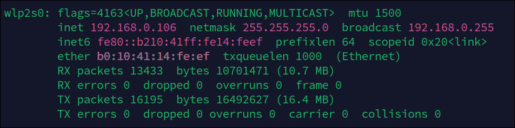
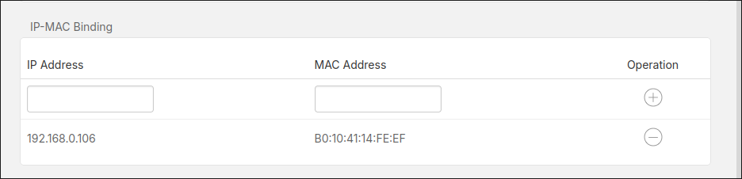
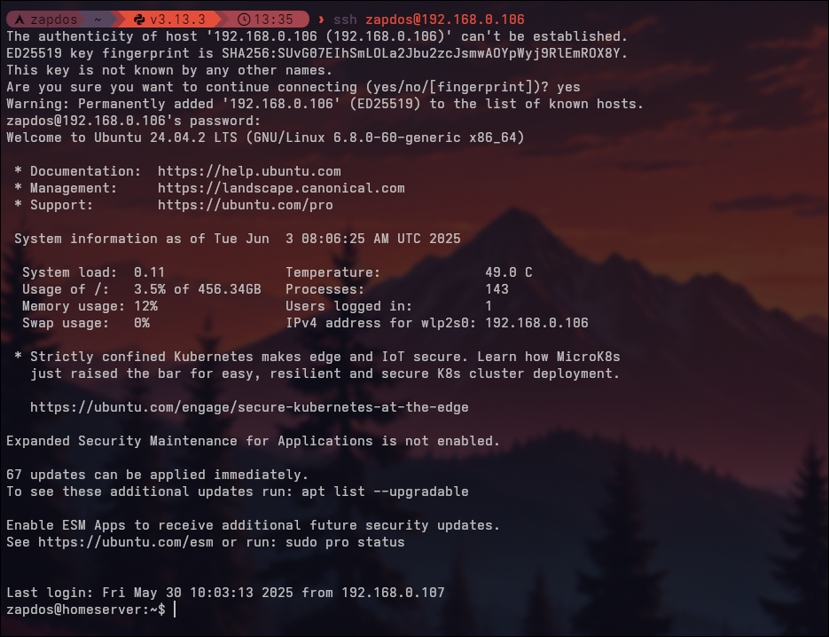

In this blog post, I share how I converted my old laptop into a private Google Photos alternative. It's a rewarding weekend project for tinkerers and a great way to reuse old tech meaningfully!

## The Goal

* Set up **Immich**, a private photo and video backup server
* Recycle old hardware for a meaningful purpose
* Move away from Google

---

## The Hardware

Any old laptop or desktop lying around at home should work, but make sure it has a **64-bit architecture** to run smoothly. As long as it has at least **4GB of RAM** (a requirement for Immich) and an **Ethernet port**, you're good to go!

Here’s my setup:

* Laptop: **HP Notebook with Intel Celeron N2830**
* Memory: 8GB DDR3
* Storage: 500GB hard drive

It’s nowhere near powerful by today’s standards- but thanks to Linux, it’s more than capable of running a self-hosted media server.

## Before Starting

We’ll be wiping the drive clean, so back up any important data first. Also, have a USB stick ready, as we’ll use it to install the server OS.

## OS Setup

We’ll be installing **Ubuntu Server**, which comes without a graphical user interface. This helps preserve system resources by not rendering a desktop environment.

Download the latest LTS version of Ubuntu Server here:
[https://ubuntu.com/download/server](https://ubuntu.com/download/server)

**Tip:** In the *Alternative downloads* section, choose a mirror close to your location for faster download speeds.

After downloading, use a tool like [Rufus](https://rufus.ie/en/) to create a bootable USB with the ISO file.

## Boot into Live OS

Find out the boot menu key for your laptop model (usually `F12` on Lenovo, `F10` on HP, etc.).

Plug in the USB, power on the laptop, and press the boot menu key repeatedly to open the boot menu. Select your USB drive, typically listed as *UEFI flash drive* or similar.

When the GRUB menu appears, choose:
**Try or Install Ubuntu Server**

## Installing Ubuntu Server

Follow the setup wizard to configure your OS. Most options can be left at their defaults or set as you prefer.

One important step:

> **Uncheck** the option to “Set up this disk as an LVM group.”

LVM (Logical Volume Manager) isn’t needed here, since we’re using the entire disk without partitioning.

## Configuring a Static IP

At this point, you should have a working Ubuntu Server install.
Congratulations! Your old laptop is now a server.

Next, we’ll ensure the server always gets the same IP address from your Wi-Fi router.

1. On another device connected to the same network, open a browser and visit your router’s configuration page (typically `http://192.168.0.1/` or `http://192.168.1.1/`).

2. On the server, run:

   ```bash
   ifconfig
   ```

   *(Install with `sudo apt install net-tools` if needed)*

   

3. Note your laptop’s **MAC address** and the currently assigned **IP address** (e.g., `192.168.0.106`).

4. In your router’s settings, look for **DHCP reservation** or **MAC-to-IP binding**.

5. Add an entry using the MAC address and desired static IP, then save.

Your router will now always assign this IP to the laptop.



## SSH Access

From now on, you can access your laptop remotely via **SSH**, as long as it's connected to your network.

Open a terminal or command prompt and run:

```bash
ssh username@192.168.0.106
```

Replace `username` with the Linux user you created, and `192.168.0.106` with your actual IP.

Enter your password when prompted (note: it won’t appear as you type).



## Configuration

Since the server will run 24/7, we don’t want it to sleep when the lid is closed.

This behavior is controlled in the login daemon config file:

```
/etc/systemd/logind.conf
```

To edit it:

```bash
sudo nano /etc/systemd/logind.conf
```

Make the following changes:

* Uncomment the line:
  `HandleLidSwitch=suspend` → change `suspend` to `ignore`
* Uncomment the line:
  `LidSwitchIgnoreInhibited=no` → change to `yes`

This prevents the system from sleeping when the lid is shut.

## Installing Immich

Follow the official Immich documentation to install and configure the server:
[https://immich.app/docs/overview/quick-start](https://immich.app/docs/overview/quick-start)

## Finishing Up

Once setup is complete, Immich should be accessible within your local network at:
`http://192.168.0.106:2283`
*(Replace with your actual server IP)*

You can also install the **Immich mobile app** and connect it using this URL.

## Next Steps

With your server ready, here are a few more ideas for expanding its functionality:

* Host a home VPN (e.g., **WireGuard**)
* Set up network-wide ad blocking (**AdGuard Home** or **Pi-hole**)
* Create a media server for streaming (**Jellyfin**)

Explore more possibilities on **[Awesome Selfhosted](https://awesome-selfhosted.net/)**- a curated list of self-hostable applications.

---


